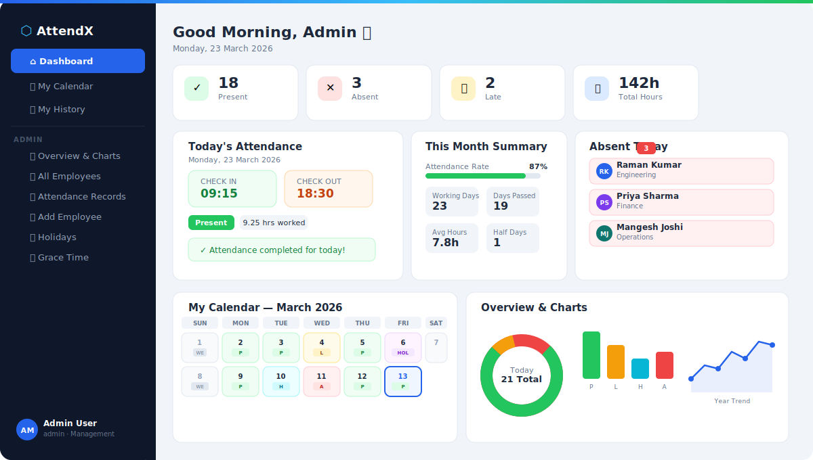

# attendx_em6logistics

# ⬡ AttendX — Corporate Attendance Management System



> A complete, single-file web app for corporate attendance tracking — built with vanilla HTML, JavaScript, Bootstrap 5, and Firebase. No backend server needed. Deploy in minutes.

---

## 🌐 Live Demo

Deploy your own → [Netlify](https://netlify.com) · [Vercel](https://vercel.com) · [Firebase Hosting](https://firebase.google.com/docs/hosting)

---

## 📋 Table of Contents

- [Overview](#overview)
- [Features](#features)
- [Tech Stack](#tech-stack)
- [Screenshots](#screenshots)
- [Getting Started](#getting-started)
- [Firebase Setup](#firebase-setup)
- [Deployment](#deployment)
- [Security](#security)
- [Firestore Data Structure](#firestore-data-structure)
- [Roles](#roles)

---

## Overview

AttendX solves the end-of-month attendance headache for corporate teams. Each employee logs in, marks their daily check-in and check-out, and can view their own history in a calendar view. The admin gets a live dashboard showing who's in, who's absent, charts across day/month/year, full filtering, and one-click Excel export — all without touching a spreadsheet manually.

---

## ✨ Features

### 👤 Employee Features

| Feature | Description |
|---|---|
| **Secure Login** | Email + password authentication via Firebase Auth |
| **One-Click Check In** | Records exact timestamp at click |
| **One-Click Check Out** | Auto-calculates hours worked |
| **Smart Status Detection** | Auto-marks Present, Late, or Half Day based on rules |
| **Dashboard Stats** | Monthly present/absent/late/hours counters |
| **Attendance Rate** | Visual progress bar showing monthly attendance % |
| **Calendar View** | Color-coded monthly calendar (P/L/H/A/WE/Holiday) |
| **Day Detail** | Click any calendar day to see full in/out record |
| **History Table** | Full personal attendance history, sortable |
| **Excel Export** | Download own attendance as `.xlsx` file |

---

### 🛡️ Admin Features

| Feature | Description |
|---|---|
| **Live Overview Dashboard** | Real-time present/absent/late counts for today |
| **Absent Today Panel** | Named list of every employee not yet checked in |
| **3 Chart Views** | Doughnut (today), Bar (month by status), Line (year trend) |
| **All Employees** | Full employee directory with department, role, designation |
| **View Any Employee** | See any individual's full attendance history |
| **Edit Any Record** | Modify check-in time, check-out time, and status for any employee on any date |
| **Attendance Records** | Master table of all records across all employees |
| **Advanced Filters** | Filter by date range, department, status, employee name |
| **Excel Export** | Export filtered records to `.xlsx` with one click |
| **Add Employee** | Create new employee accounts directly from the app |
| **Holiday Manager** | Mark company holidays — they show on all calendars, no absent marking |
| **Grace Time Settings** | Set default late cutoff time (e.g. 10:00 AM) |
| **Day-Specific Overrides** | Override cutoff for a specific date (e.g. office opens late at 11:00 AM today) |

---

### 📊 Attendance Status Logic

| Status | Condition |
|---|---|
| **Present** | Checked in before the cutoff time |
| **Late** | Checked in after the configured cutoff time |
| **Half Day** | Worked less than 4 hours (auto-detected on checkout) |
| **Absent** | No check-in recorded for a past working day |
| **Leave** | Manually set by admin |
| **Holiday** | Date marked as holiday by admin — no absent recorded |

---

## 🛠️ Tech Stack

| Layer | Technology |
|---|---|
| **Frontend** | HTML5, CSS3, Vanilla JavaScript (ES Modules) |
| **UI Framework** | Bootstrap 5.3 |
| **Icons** | Bootstrap Icons 1.11 |
| **Fonts** | Google Fonts — DM Sans + Syne |
| **Authentication** | Firebase Auth (Email/Password) |
| **Database** | Cloud Firestore (NoSQL) |
| **Charts** | Chart.js 4.4 |
| **Excel Export** | SheetJS (XLSX) |
| **Hosting** | Any static host — Vercel, Netlify, Firebase Hosting |

---

## 🚀 Getting Started

### Step 1 — Clone or Download

```bash
# Clone
git clone https://github.com/yourusername/attendx.git

# Or just download attendance-app.html
```

### Step 2 — Firebase Project Setup

1. Go to [console.firebase.google.com](https://console.firebase.google.com)
2. Click **Add project** → name it (e.g. `AttendX`)
3. Disable Google Analytics → **Create project**

### Step 3 — Enable Authentication

1. Firebase Console → **Authentication** → **Get started**
2. **Sign-in method** → **Email/Password** → Enable → Save

### Step 4 — Create Firestore Database

1. Firebase Console → **Firestore Database** → **Create database**
2. Choose **Start in test mode**
3. Select region: `asia-south1 (Mumbai)` for India
4. Click **Enable**

### Step 5 — Get Your Firebase Config

1. ⚙️ **Project Settings** → scroll to **Your apps** → click `</>` Web
2. Register app → copy the `firebaseConfig` object
3. Paste it into `attendance-app.html` replacing the placeholder:

```javascript
const firebaseConfig = {
  apiKey:            "YOUR_API_KEY",
  authDomain:        "YOUR_PROJECT.firebaseapp.com",
  projectId:         "YOUR_PROJECT_ID",
  storageBucket:     "YOUR_PROJECT.appspot.com",
  messagingSenderId: "YOUR_SENDER_ID",
  appId:             "YOUR_APP_ID"
};
```

### Step 6 — Create First Admin User

**In Firebase Console → Authentication → Users → Add user:**
- Email: `admin@yourcompany.com`
- Password: (your choice)
- Copy the **User UID** shown

**In Firestore → `users` collection → New document:**
- Document ID: *(paste the UID)*
- Fields:

```
name        → "Admin Name"
email       → "admin@yourcompany.com"
department  → "Management"
designation → "HR Admin"
role        → "admin"
```

### Step 7 — Open & Test

Open `attendance-app.html` in your browser. Log in with the admin credentials. Done!

---

## 🔐 Security

### Firestore Rules

Once testing is complete, replace Firestore rules with these production rules:

```
rules_version = '2';
service cloud.firestore {
  match /databases/{database}/documents {

    match /users/{userId} {
      allow read: if request.auth != null;
      allow write: if request.auth != null &&
        get(/databases/$(database)/documents/users/$(request.auth.uid)).data.role == "admin";
    }

    match /attendance/{docId} {
      allow read: if request.auth != null;
      allow create: if request.auth != null &&
        request.resource.data.uid == request.auth.uid;
      allow update: if request.auth != null && (
        resource.data.uid == request.auth.uid ||
        get(/databases/$(database)/documents/users/$(request.auth.uid)).data.role == "admin"
      );
    }

    match /holidays/{docId} {
      allow read: if request.auth != null;
      allow write: if request.auth != null &&
        get(/databases/$(database)/documents/users/$(request.auth.uid)).data.role == "admin";
    }

    match /settings/{docId} {
      allow read: if request.auth != null;
      allow write: if request.auth != null &&
        get(/databases/$(database)/documents/users/$(request.auth.uid)).data.role == "admin";
    }
  }
}
```

### Authorized Domains

Firebase Console → Authentication → Settings → **Authorized domains**  
Add your live domain (e.g. `attendx.vercel.app`) so login only works on your site.

> **Note on Firebase credentials:** The `firebaseConfig` object in frontend apps is intentionally public by design — it's an identifier, not a secret. Security is enforced by Firestore Rules and Authorized Domains, not by hiding the config.

---

## ☁️ Deployment

### Option A — Netlify (Easiest, No Terminal)

1. Rename `attendance-app.html` → `index.html`
2. Go to [netlify.com](https://netlify.com)
3. Drag and drop `index.html` onto the Netlify dashboard
4. Live URL generated instantly

### Option B — Vercel

1. Go to [vercel.com](https://vercel.com) → New Project
2. Upload `index.html` (renamed to `index.html`)
3. Deploy → get `yourapp.vercel.app`

### Option C — Firebase Hosting

```bash
npm install -g firebase-tools
firebase login
mkdir attendx && cd attendx
mkdir public
cp /path/to/attendance-app.html public/index.html
firebase init hosting
# Set public dir → public
# Single page app → Yes
firebase deploy
```

---

## 🗂️ Firestore Data Structure

```
Firestore Root
│
├── users/
│   └── {uid}                    ← Firebase Auth UID as document ID
│       ├── name: "Jane Doe"
│       ├── email: "jane@company.com"
│       ├── department: "Finance"
│       ├── designation: "Senior Analyst"
│       ├── employeeId: "EMP-001"
│       ├── role: "employee"     ← "employee" or "admin"
│       └── createdAt: timestamp
│
├── attendance/
│   └── {uid}_{YYYY-MM-DD}       ← e.g. "abc123_2026-03-23"
│       ├── uid: "abc123"
│       ├── name: "Jane Doe"
│       ├── department: "Finance"
│       ├── date: "2026-03-23"
│       ├── inTime: "09:15"
│       ├── outTime: "18:30"
│       ├── workHours: 9.25
│       ├── status: "Present"    ← Present | Late | Half Day | Absent | Leave
│       └── timestamp: serverTimestamp
│
├── holidays/
│   └── {YYYY-MM-DD}             ← e.g. "2026-03-25"
│       ├── date: "2026-03-25"
│       ├── name: "Holi"
│       └── createdBy: "admin-uid"
│
└── settings/
    └── attendance               ← Single document
        ├── lateAfter: "10:00"   ← Default late cutoff (HH:MM)
        └── dayOverrides: {
              "2026-03-23": "11:00"   ← Date-specific cutoff
            }
```

---

## 👥 Roles

### Employee
- View own dashboard and stats
- Check in / Check out daily
- View own calendar (color-coded)
- View own attendance history
- Export own history to Excel

### Admin
- All employee features (admin also has their own attendance)
- Live overview dashboard with charts
- View and edit any employee's attendance
- Add new employee accounts
- Manage holidays
- Configure grace time and day overrides
- Export any data to Excel

---

## 📅 Firestore Indexes Required

Go to Firestore → **Indexes** and create:

| Collection | Field 1 | Field 2 | Scope |
|---|---|---|---|
| `attendance` | `uid` ↑ | `date` ↓ | Collection |
| `attendance` | `uid` ↑ | `date` ↑ | Collection |
| `attendance` | `date` ↓ | — | Collection |

---

## 📦 Dependencies (All CDN, No npm Required)

| Library | Version | Purpose |
|---|---|---|
| Bootstrap | 5.3.2 | UI framework and components |
| Bootstrap Icons | 1.11.3 | Icon set |
| Firebase JS SDK | 10.12.0 | Auth + Firestore |
| Chart.js | 4.4.0 | Dashboard charts |
| SheetJS (XLSX) | 0.18.5 | Excel file export |
| Google Fonts | — | DM Sans + Syne typefaces |

---

## 🤝 Built By

Built by **Raman** as a client project for corporate attendance tracking.  
Stack: Firebase + Bootstrap + Vanilla JS — zero build tools, zero dependencies to install.

---

## 📄 License

MIT License — free to use, modify, and deploy for personal or commercial projects.
